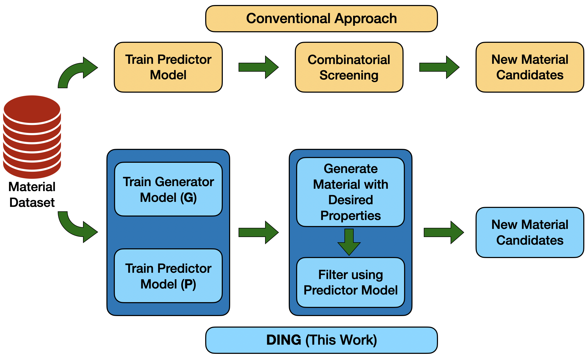

# DEEP LEARNING ENABLED INORGANIC MATERIAL GENERATOR (DING)
DING is a framework that can be used for generating inorganic material candidates with given target properties. It consists of a generator module and a predictor module and uses the properties enthalpy of formation, volume per atom and energy per atom from the OQMD Dataset  

In conventional approaches for generating new materials, first a predictor model is trained, then materials are generated combinatorially and the potential candidates are screened using the predictor network. In DING model, generator and predictor models are trained and then the generator model is used to identify potential candidates with the desired properties, which
are finally evaluated using the predictor network. This results in a small search space and achieves efficient sampling of the material space.

This repository contains the code for training the three predictor models, the CVAE-based generator, a VAE-based baseline generator and the code for all the analyisis that is reported in the paper.

## Installation
All the packages listed in `requirements.txt` must be installed in a Python 3.6 environment with jupyter using
```python
pip install -r requirements.txt
```

## Source Code
The code is written in Jupyter notebooks with Python3 kernel. It is divided into 4 directories: `CVAE`, `VAE`, `Predictors` and `Generation-Analysis`, and a notebook `Dataset Analysis.ipynb`
A brief explanation about the contents of the folders and notebooks is given below:
* [`Dataset Analysis.ipynb`](./Dataset%20Analysis.ipynb): Code for plotting the distributions of the three target properties in the dataset.

- CVAE
  - [`train_generator.ipynb`](./CVAE/train_generator.ipynb): Code for training the Conditional Variational Autoencoder based material generator. It saves the best model and the corresponding decoder in the files `ding_model_best.h5` and `ding_decoder_best.h5` in the same directory. 

- VAE
  - [`train_generator.ipynb`](./VAE/train_generator.ipynb): Code for training a baseline Variational Autoencoder based material generator. This is used to show that adding the property bias in CVAE helps to generate material with target properties. It saves the best model and the corresponding decoder in the files `vae_model_best.h5` and `vae_decoder_best.h5` in the same directory. 

- Predictors
  - [`train_predictor.ipynb`](Predictors/train_predictor.ipynb): Code for training the three predictor models for enthalpy of formation, volume per atom and energy per atom. It saves the three models under the names `delta_e_best_model.h5`, `volume_pa_best_model.h5` and `energy_pa_best_model.h5`
  - [`Analysis - Coefficient of Determination.ipynb`](Predictors/Coefficient%20of%20Determination.ipynb): Code for plotting the predicted values of the properties for the test set vs the ground truth, along with the R^2 values.
  - [`Analysis - Applicability Range.ipynb`](Predictors/Analysis%20-%20Applicability%20Range.ipynb): Code for finding the low error range for each property, where the DING model is applicable.
  
- Generation-Analysis
  - [`Property Distribution.ipynb`](Generation-Analysis/Property%20Distribution.ipynb): Code for generating new materials with both the CVAE and VAE models, and plotting the distribution of the properties of the generated materials
  - [`Continuous Generation.ipynb`](Generation-Analysis/Continuous%20Generation.ipynb): Code for checking the continuity of the latent space in CVAE model by walking the space between two generated materials.
  
## Running the Code
Before running any of the notebooks, a new folder `Data` must be created with the dataset, along with the train and test splits, all saved as CSVs. These are loaded in each notebook using Pandas.

## Publication
If you find this useful in your research, please cite:

	@article{DING,
	title={Deep Learning Enabled Inorganic Material Generator},
	author={Y. Pathak, K. Singh, G. Varma, M. Ehara and U. D. Priyakumar},
	journal={ChemRxiv},
	year={2020},
	doi={https://doi.org/10.26434/chemrxiv.12312260.v1}
	}	

